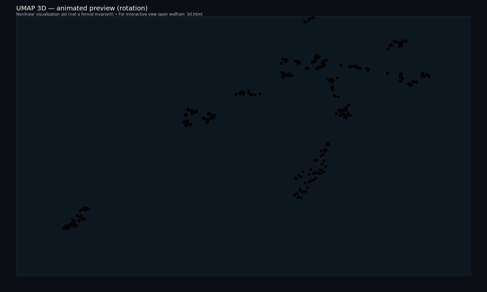

# Wolfram Physics Formalization

<p align="center">
  <strong>Machine-checked proof that confluence and causal invariance are independent properties</strong><br/>
  <em>
    Lean 4 formalization of Piskunov's 2020 counterexamples for Wolfram Physics / SetReplace systems
    + a Wolfram Physics Project WM148 causal-invariance case study (fresh-vertex semantics)
  </em>
</p>

<p align="center">
  
  
  
  
</p>

---

Part of the broader HeytingLean formal verification project: https://apoth3osis.io

## What’s New (WM148)

This repo now also includes a Wolfram Physics Project example **WM148**:

- rule: `{{x,y}} → {{x,y},{y,z}}` (one fresh vertex `z`)
- semantics: explicit fresh allocation + equivalence up to vertex renaming (`HGraph.Iso`)
- mechanized theorem: `WM148.causalInvariant : SystemFresh.CausalInvariant (sys := WM148.sys)`
- executable demo: `lake exe wolfram_wm148_demo` (emits bounded multiway JSON)

## The Independence Theorem

<p align="center">
  
</p>

<p align="center"><em>CE1 Multiway + Branchial Graph: Confluent but NOT causally invariant</em></p>

In the [Wolfram Physics Project](https://www.wolframphysics.org/), **causal invariance** was proposed as the keystone property ensuring observer-independent physics. Many assumed it was equivalent to **confluence** (unique normal forms).

This formalization proves they are **independent**:
- Systems can be confluent without being causally invariant
- Systems can be causally invariant without being confluent

---

## Counterexamples Visualized

<table>
<tr>
<td align="center" width="50%">

<br/><strong>CE1: Confluent ∧ ¬Causal-Invariant</strong><br/>
<em>All paths converge to same normal form,<br/>but causal graphs differ</em>
</td>
<td align="center" width="50%">

<br/><strong>CE2: Causal-Invariant ∧ ¬Confluent</strong><br/>
<em>Multiple normal forms exist,<br/>but causal graphs are isomorphic</em>
</td>
</tr>
<tr>
<td align="center">

<br/><em>CE1 Branchial structure</em>
</td>
<td align="center">

<br/><em>CE2 Branchial structure</em>
</td>
</tr>
</table>

---

## Interactive Proof Graph Viewers

Explore the proof structure in 2D and 3D:

<table>
<tr>
<td align="center" width="50%">
<strong>2D Proof Map</strong><br/>
<em>Pan, zoom, search declarations</em><br/>
<a href="https://abraxas1010.github.io/causal-confluence-wolfram-lean/RESEARCHER_BUNDLE/artifacts/visuals/wolfram_2d.html">
  
</a><br/>
<a href="https://abraxas1010.github.io/causal-confluence-wolfram-lean/RESEARCHER_BUNDLE/artifacts/visuals/wolfram_2d.html">wolfram_2d.html</a> (GitHub Pages)
</td>
<td align="center" width="50%">
<strong>3D Proof Map</strong><br/>
<em>Rotate, zoom, explore clusters</em><br/>
<a href="https://abraxas1010.github.io/causal-confluence-wolfram-lean/RESEARCHER_BUNDLE/artifacts/visuals/wolfram_3d.html">
  
</a><br/>
<a href="https://abraxas1010.github.io/causal-confluence-wolfram-lean/RESEARCHER_BUNDLE/artifacts/visuals/wolfram_3d.html">wolfram_3d.html</a> (GitHub Pages)
</td>
</tr>
</table>

Declarations visualized with UMAP embeddings:
- Color-coded by module family (Hypergraph, Rewrite, CausalGraph, Multiway, etc.)
- Click nodes to see theorem details, file location, and code snippets.
- kNN edges show proof similarity neighborhoods.

Interactive multiway viewer (load `generated_ce1.json` / `generated_ce2.json` / `generated_wm148.json`):
- GitHub Pages: https://abraxas1010.github.io/causal-confluence-wolfram-lean/RESEARCHER_BUNDLE/artifacts/wolfram_viewer.html
- Offline: `RESEARCHER_BUNDLE/wolfram_viewer.html` (wrapper) or `RESEARCHER_BUNDLE/artifacts/wolfram_viewer.html` (direct)

**UMAP note (interpretation + limitations):**
- UMAP is a non-linear projection of high-dimensional feature vectors into 2D/3D; here the features are derived from Lean source text statistics and structural signals.
- Only *local neighborhoods* are intended to be meaningful; global distances/cluster geometry are not proof-theoretic invariants.
- The layout depends on hyperparameters and a random seed; reruns can rotate/warp the embedding while preserving similar local structure.
- Treat these maps as navigational aids; the formal guarantee is always the Lean kernel check, not the embedding.
- GitHub README pages block embedded iframes/WebGL; the README shows a lightweight preview, while the full interactive 3D viewer is on GitHub Pages.

---

## What's Formalized

| Component | Description |
|-----------|-------------|
| **Hypergraph Model** | SetReplace-faithful: `Expr V := List V`, `HGraph V := Multiset (Expr V)` |
| **Rewrite Semantics** | Rules, events, SetReplace-style substitutions (not assumed injective), applicability |
| **Fresh-Vertex Semantics** | Explicit fresh-name supply + α-equivalence up to vertex renaming |
| **Injective-WLOG Lemmas** | Under a “simple hypergraph” invariant, applicable matches are forced injective (standard `Fin n`/`finRange` LHS shape) |
| **Causal Graphs** | "Created then destroyed" edges, graph isomorphism |
| **Properties** | `ConfluentNF` (unique normal forms), `CausalInvariant` (isomorphic causal graphs) |
| **Counterexamples** | CE1: confluent ∧ ¬causal-invariant, CE2: causal-invariant ∧ ¬confluent |
| **Main Theorem** | `confluence_causal_invariance_independent` |
| **Multiway Infrastructure** | Finite enumerators, branchial graphs, WPP bridges |
| **WM148 (Wolfram Physics)** | `{{x,y}} → {{x,y},{y,z}}` with explicit fresh vertices + causal invariance proof (branch-pair resolution up to `HGraph.Iso`) |

---

## Quick Start

### Verify Everything (One Command)

```bash
cd RESEARCHER_BUNDLE
./scripts/verify_wolfram.sh
```

This runs strict builds, runs the Wolfram multiway demo, and also emits + checks a small certified
**LambdaIR → MiniC → C** compilation artifact (see `RESEARCHER_BUNDLE/artifacts/compiler/`).

### Run the Demo

```bash
cd RESEARCHER_BUNDLE
lake exe wolfram_multiway_demo              # CE1 (default)
lake exe wolfram_multiway_demo -- --sys ce2  # CE2
lake exe wolfram_wm148_demo                 # WM148 (fresh-vertex semantics; bounded multiway JSON)
```

### Emit Verified Compiler Artifacts (LambdaIR → C)

From the standalone bundle:

```bash
cd RESEARCHER_BUNDLE
lake exe wolfram_bundle_demo
cc artifacts/compiler/c/wpp_add1.c -O2 -std=c11 -o artifacts/compiler/bin/wpp_add1
./artifacts/compiler/bin/wpp_add1   # expected output: 42
```

### Run in Wolfram Language (optional)

This repo ships a pure **Wolfram Language** script that reproduces the CE1/CE2 bounded multiway JSON
output of `wolfram_multiway_demo`, for cross-checking against Wolfram/SetReplace tooling:

- `RESEARCHER_BUNDLE/tools/wolfram_ce1_ce2.wl`

In Mathematica / Wolfram Engine:

```wl
Get["RESEARCHER_BUNDLE/tools/wolfram_ce1_ce2.wl"];
Export["ce1_from_wl.json", CE1JSON[3], "JSON"];
Export["ce2_from_wl.json", CE2JSON[2], "JSON"];
```

Compare against the Lean-produced files:

- `RESEARCHER_BUNDLE/artifacts/generated_ce1.json`
- `RESEARCHER_BUNDLE/artifacts/generated_ce2.json`

If you have `wolframscript` installed, the bundle also provides an automated cross-check:

```bash
cd RESEARCHER_BUNDLE
./scripts/verify_wolfram_wl.sh
```

If you do not have Wolfram Engine installed, the same cross-check can be run with the open-source WL runtime `mathics`:

```bash
python3 -m pip install --user mathics3 packaging
cd RESEARCHER_BUNDLE
./scripts/verify_wolfram_wl.sh
```

See also the (static) pipeline diagram:

- `RESEARCHER_BUNDLE/artifacts/visuals/wl_crosscheck_pipeline.svg`


---

## Key Theorems

```lean
-- Main independence result
theorem confluence_causal_invariance_independent :
  (∃ sys, ConfluentNF sys ∧ ¬CausalInvariant sys) ∧
  (∃ sys, CausalInvariant sys ∧ ¬ConfluentNF sys)

-- CE1: confluent but not causally invariant
theorem CE1.confluentNF : ConfluentNF CE1.system
theorem CE1.not_causalInvariant : ¬CausalInvariant CE1.system

-- CE2: causally invariant but not confluent
theorem CE2.causalInvariant : CausalInvariant CE2.system
theorem CE2.not_confluentNF : ¬ConfluentNF CE2.system

-- WM148: causally invariant (fresh-vertex semantics; branch-pair resolution up to renaming)
theorem WM148.causalInvariant : SystemFresh.CausalInvariant (sys := WM148.sys)

-- Bridge: finite enumerator agrees with Step relation
theorem stepStates_iff_step : t ∈ stepStates s ↔ Step s t

-- Fresh-vertex semantics: different fresh allocations are isomorphic (α-equivalence)
theorem SystemFresh.Event.applyWith_iso : HGraph.Iso (e.applyWith τ₁ s) (e.applyWith τ₂ s)

-- Injective-WLOG (under simple-hypergraph invariant)
theorem System.Event.injective_of_applicable_of_finRange_mem_lhs : Function.Injective e.σ
```

---

## Axiom Footprint

The formalization uses only standard Lean kernel axioms:

| Axiom | Purpose |
|-------|---------|
| `propext` | Propositional extensionality |
| `Classical.choice` | Axiom of choice |
| `Quot.sound` | Quotient soundness |

**No project-specific axioms introduced.**

---

## Documentation

| File | Description |
|------|-------------|
| `01_Lean_Map.md` | Concept → Lean mapping |
| `02_Proof_Index.md` | What's proved and where (incl. WM148 causal invariance) |
| `03_Reproducibility.md` | Build/run commands |
| `04_Dependencies.md` | Lean/mathlib pins |
| `05_Technical_Report.md` | Technical summary |
| `06_Final_Audit.md` | QA status |
| `TECHNICAL_REPORT_FULL.md` | Full research report |

---

## Repository Structure

```
├── README.md                 # This file
├── .nojekyll                 # GitHub Pages helper
├── index.html                # GitHub Pages landing
├── 0[1-6]_*.md               # Documentation
├── TECHNICAL_REPORT_FULL.md  # Full report
├── artifacts/                # Static artifacts (SVG graphs, etc.)
├── tools/                    # Local tooling for this PaperPack
└── RESEARCHER_BUNDLE/
    ├── README_VERIFY.md              # One-command verification instructions
    ├── lean-toolchain               # Lean pin
    ├── lakefile.lean                # Lake package + pinned deps
    ├── lake-manifest.json           # Locked transitive dependency pins
    ├── HeytingLean/                 # Lean sources (WPP/Wolfram + compiler slice)
    ├── scripts/                     # `verify_wolfram.sh` (+ small helpers)
    ├── artifacts/
    │   ├── visuals/                 # 2D/3D viewers, previews, SVG graphs
    │   └── compiler/                # LambdaIR → MiniC → C outputs (+ `.olean` bundle)
    └── reports/                     # Build transcripts, hashes, portability checks
```

---

## References

1. Piskunov, M. (2020). "[Confluence and Causal Invariance](https://bulletins.wolframphysics.org/2020/11/confluence-and-causal-invariance/)." *Wolfram Physics Bulletins*

2. Wolfram, S. (2020). "[A Project to Find the Fundamental Theory of Physics](https://www.wolframphysics.org/)." *wolframphysics.org*

3. Gorard, J. (2020). "[Some Relativistic and Gravitational Properties of the Wolfram Model](https://arxiv.org/abs/2004.14810)." *arXiv:2004.14810*

4. SetReplace. "[GitHub: maxitg/SetReplace](https://github.com/maxitg/SetReplace)"

---

<p align="center">
  <em>Part of the <a href="https://apoth3osis.io">HeytingLean</a> formal verification project</em>
</p>
