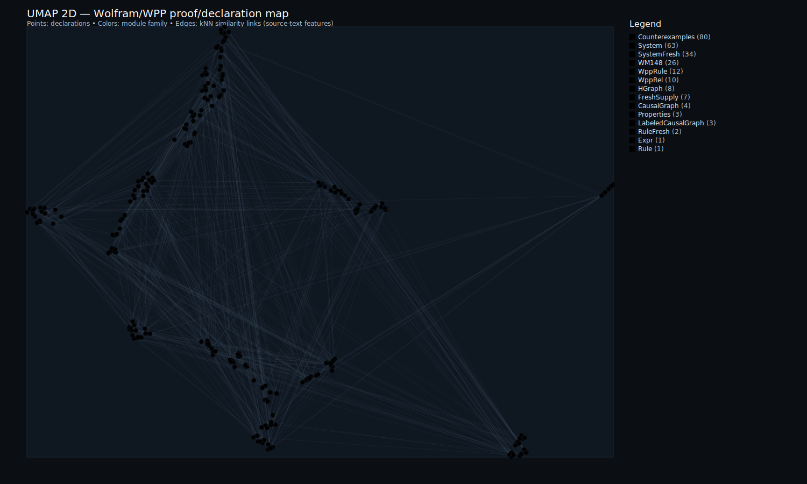

# Wolfram Physics Formalization

<p align="center">
  <strong>Machine-checked proof that confluence and causal invariance are independent properties</strong><br/>
  <em>Lean 4 formalization of Piskunov's 2020 counterexamples for Wolfram Physics / SetReplace systems</em>
</p>

<p align="center">
  
  
  
  
</p>

---

## The Independence Theorem

<p align="center">
  
</p>

<p align="center"><em>CE1 Multiway + Branchial Graph: Confluent but NOT causally invariant</em></p>

In the [Wolfram Physics Project](https://www.wolframphysics.org/), **causal invariance** was proposed as the keystone property ensuring observer-independent physics. Many assumed it was equivalent to **confluence** (unique normal forms).

This formalization proves they are **independent**:
- Systems can be confluent without being causally invariant
- Systems can be causally invariant without being confluent

---

## Counterexamples Visualized

<table>
<tr>
<td align="center" width="50%">

<br/><strong>CE1: Confluent ∧ ¬Causal-Invariant</strong><br/>
<em>All paths converge to same normal form,<br/>but causal graphs differ</em>
</td>
<td align="center" width="50%">

<br/><strong>CE2: Causal-Invariant ∧ ¬Confluent</strong><br/>
<em>Multiple normal forms exist,<br/>but causal graphs are isomorphic</em>
</td>
</tr>
<tr>
<td align="center">

<br/><em>CE1 Branchial structure</em>
</td>
<td align="center">

<br/><em>CE2 Branchial structure</em>
</td>
</tr>
</table>

---

## What's Formalized

| Component | Description |
|-----------|-------------|
| **Hypergraph Model** | SetReplace-faithful: `Expr V := List V`, `HGraph V := Multiset (Expr V)` |
| **Rewrite Semantics** | Rules, events, injective substitutions, applicability |
| **Causal Graphs** | "Created then destroyed" edges, graph isomorphism |
| **Properties** | `ConfluentNF` (unique normal forms), `CausalInvariant` (isomorphic causal graphs) |
| **Counterexamples** | CE1: confluent ∧ ¬causal-invariant, CE2: causal-invariant ∧ ¬confluent |
| **Main Theorem** | `confluence_causal_invariance_independent` |
| **Multiway Infrastructure** | Finite enumerators, branchial graphs, WPP bridges |

---

## Quick Start

### Verify Everything (One Command)

```bash
cd RESEARCHER_BUNDLE
./scripts/verify_wolfram.sh
```

This runs strict builds, runs the Wolfram multiway demo, and also emits + checks a small certified
**LambdaIR → MiniC → C** compilation artifact (see `RESEARCHER_BUNDLE/artifacts/compiler/`).

### Run the Demo

```bash
cd lean
lake exe wolfram_multiway_demo              # CE1 (default)
lake exe wolfram_multiway_demo -- --sys ce2  # CE2
```

### Emit Verified Compiler Artifacts (LambdaIR → C)

From the standalone bundle:

```bash
cd RESEARCHER_BUNDLE
lake exe wolfram_bundle_demo
cc artifacts/compiler/c/wpp_add1.c -O2 -std=c11 -o artifacts/compiler/bin/wpp_add1
./artifacts/compiler/bin/wpp_add1   # expected output: 42
```

---

## Key Theorems

```lean
-- Main independence result
theorem confluence_causal_invariance_independent :
  (∃ sys, ConfluentNF sys ∧ ¬CausalInvariant sys) ∧
  (∃ sys, CausalInvariant sys ∧ ¬ConfluentNF sys)

-- CE1: confluent but not causally invariant
theorem CE1.confluentNF : ConfluentNF CE1.system
theorem CE1.not_causalInvariant : ¬CausalInvariant CE1.system

-- CE2: causally invariant but not confluent
theorem CE2.causalInvariant : CausalInvariant CE2.system
theorem CE2.not_confluentNF : ¬ConfluentNF CE2.system

-- Bridge: finite enumerator agrees with Step relation
theorem stepStates_iff_step : t ∈ stepStates s ↔ Step s t
```

---

## Axiom Footprint

The formalization uses only standard Lean kernel axioms:

| Axiom | Purpose |
|-------|---------|
| `propext` | Propositional extensionality |
| `Classical.choice` | Axiom of choice |
| `Quot.sound` | Quotient soundness |

**No project-specific axioms introduced.**

---

## Interactive Proof Graph Viewers

Explore the proof structure in 2D and 3D:

<table>
<tr>
<td align="center" width="50%">
<strong>2D Proof Map</strong><br/>
<em>Pan, zoom, search declarations</em><br/>
<a href="https://abraxas1010.github.io/causal-confluence-wolfram-lean/RESEARCHER_BUNDLE/artifacts/visuals/wolfram_2d.html">
  
</a><br/>
<a href="https://abraxas1010.github.io/causal-confluence-wolfram-lean/RESEARCHER_BUNDLE/artifacts/visuals/wolfram_2d.html">wolfram_2d.html</a> (GitHub Pages)
</td>
<td align="center" width="50%">
<strong>3D Proof Map</strong><br/>
<em>Rotate, zoom, explore clusters</em><br/>
<a href="https://abraxas1010.github.io/causal-confluence-wolfram-lean/RESEARCHER_BUNDLE/artifacts/visuals/wolfram_3d.html">
  
</a><br/>
<a href="https://abraxas1010.github.io/causal-confluence-wolfram-lean/RESEARCHER_BUNDLE/artifacts/visuals/wolfram_3d.html">wolfram_3d.html</a> (GitHub Pages)
</td>
</tr>
</table>

**154 declarations** visualized with UMAP embeddings:
- Color-coded by module family (Hypergraph, Rewrite, CausalGraph, Multiway, etc.)
- Click nodes to see theorem details, file location, and code snippets
- kNN edges show proof similarity relationships

**UMAP note (interpretation + limitations):**
- UMAP is a non-linear projection of high-dimensional feature vectors into 2D/3D; here the features are derived from Lean source text statistics and structural signals.
- Only *local neighborhoods* are intended to be meaningful; global distances/cluster geometry are not proof-theoretic invariants.
- The layout depends on hyperparameters and a random seed; reruns can rotate/warp the embedding while preserving similar local structure.
- Treat these maps as navigational aids; the formal guarantee is always the Lean kernel check, not the embedding.

Also available: [Interactive Multiway Viewer](https://abraxas1010.github.io/causal-confluence-wolfram-lean/RESEARCHER_BUNDLE/artifacts/wolfram_viewer.html) for exploring CE1/CE2 graph evolution.

### GitHub Pages (rendered HTML)

GitHub will show HTML files as source code when clicked inside the repo browser. To get clickable, rendered versions,
enable GitHub Pages for the Wolfram PaperPack repository and use the Pages URL:

1. GitHub repo → **Settings** → **Pages**
2. **Build and deployment** → **Source:** “Deploy from a branch”
3. Select **Branch:** `main` and **Folder:** `/ (root)` and save
4. After Pages publishes, open:
   - `https://abraxas1010.github.io/causal-confluence-wolfram-lean/` (landing page)
   - `https://abraxas1010.github.io/causal-confluence-wolfram-lean/RESEARCHER_BUNDLE/artifacts/visuals/wolfram_2d.html`
   - `https://abraxas1010.github.io/causal-confluence-wolfram-lean/RESEARCHER_BUNDLE/artifacts/visuals/wolfram_3d.html`
   - `https://abraxas1010.github.io/causal-confluence-wolfram-lean/RESEARCHER_BUNDLE/artifacts/wolfram_viewer.html`

---

## Documentation

| File | Description |
|------|-------------|
| `01_Lean_Map.md` | Concept → Lean mapping |
| `02_Proof_Index.md` | What's proved and where (29 indexed results) |
| `03_Reproducibility.md` | Build/run commands |
| `04_Dependencies.md` | Lean/mathlib pins |
| `05_Technical_Report.md` | Technical summary |
| `06_Final_Audit.md` | QA status |
| `TECHNICAL_REPORT_FULL.md` | Full research report |

---

## Repository Structure

```
├── README.md                    # This file
├── 0[1-6]_*.md                 # Documentation
├── TECHNICAL_REPORT_FULL.md    # Full report
├── artifacts/                   # JSON outputs, SVG graphs
└── RESEARCHER_BUNDLE/
    ├── HeytingLean/            # Lean source (WPP/Wolfram slice)
    ├── scripts/                # verify_wolfram.sh
    ├── artifacts/visuals/      # SVG multiway/branchial graphs
    └── reports/                # Build transcripts, checksums
```

---

## References

1. Piskunov, M. (2020). "[Confluence and Causal Invariance](https://bulletins.wolframphysics.org/2020/11/confluence-and-causal-invariance/)." *Wolfram Physics Bulletins*

2. Wolfram, S. (2020). "[A Project to Find the Fundamental Theory of Physics](https://www.wolframphysics.org/)." *wolframphysics.org*

3. Gorard, J. (2020). "[Some Relativistic and Gravitational Properties of the Wolfram Model](https://arxiv.org/abs/2004.14810)." *arXiv:2004.14810*

4. SetReplace. "[GitHub: maxitg/SetReplace](https://github.com/maxitg/SetReplace)"

---

<p align="center">
  <em>Part of the <a href="https://github.com/Abraxas1010">HeytingLean</a> formal verification project</em>
</p>
